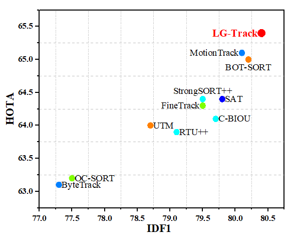
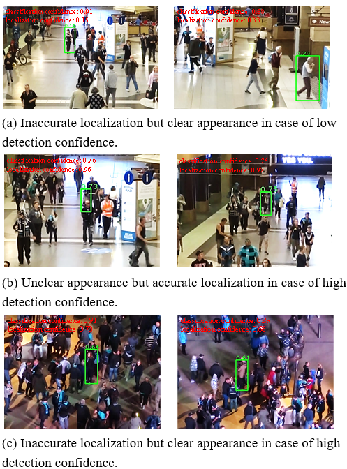
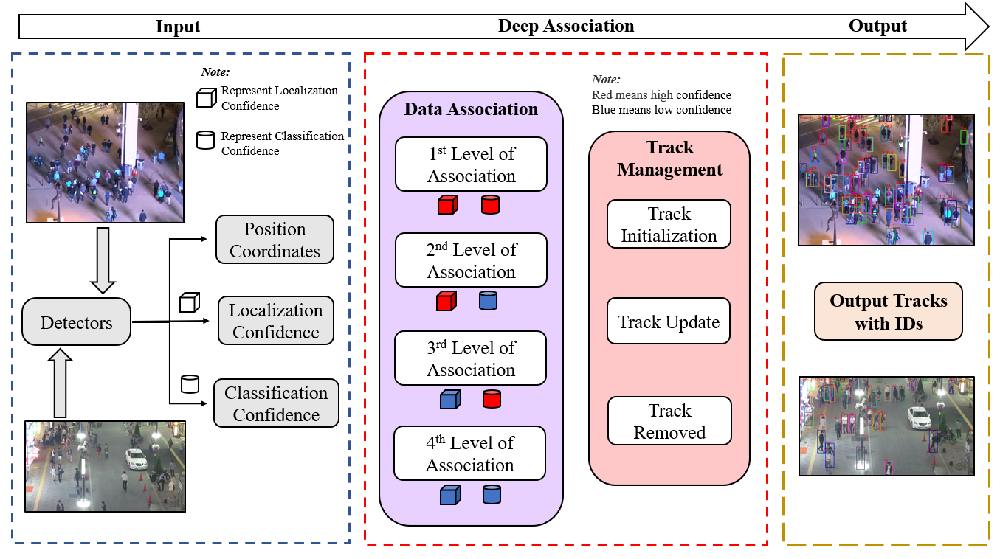
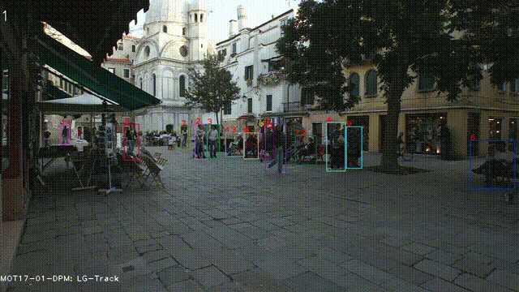
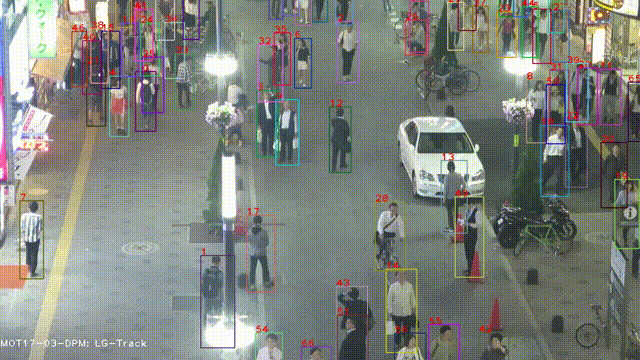

# Localization-Guided Track: A Deep Association Multi-Object Tracking Framework Based on Localization Confidence of Detections

#### LG-Track is a simple, robust and reliable tracker
> [**Localization-Guided Track: A Deep Association Multi-Object Tracking Framework Based on Localization Confidence of Detections**](http://arxiv.org/abs/2309.09765)

<p align="center"></p>

## Update
*[2023/12] we proposed Deep LG-Track, which makes LG-Track more robust. We will release the paper of Deep LG-Track as soon as we can.
###Results on MOT17 test set
| Tracker     |  HOTA | AssA | IDF1 | MOTA  | DetA  | 
|:-----------:|:-----:|:----:|:----:|:-----:|:-----:|
|LG-Track     | 65.4  | 65.4 | 80.4 | 81.4  | 65.6  | 
|Deep LG-Track| 65.9  | 66.5 | 81.4 | 81.3  | 65.5  | 
###Results on MOT20 test set
| Tracker     |  HOTA | AssA | IDF1 | MOTA  | DetA  | 
|:-----------:|:-----:|:----:|:----:|:-----:|:-----:|
|LG-Track     | 63.4  | 62.9 | 77.4 | 77.8  | 64.1  |  
|Deep LG-Track| 63.9  | 64.1 | 78.4 | 77.6  | 64.0  | 

## Abstract

In currently available literature, no tracking-by-detection (TBD) paradigm-based tracking method has considered the localization confidence of detection boxes. In most TBD-based methods, it is considered that objects of low detection confidence are highly occluded and thus it is a normal practice to directly disregard such objects or to reduce their priority in matching. In addition, appearance similarity is not a factor to consider for matching these objects. However, in terms of the detection confidence fusing classification and localization, objects of low detection confidence may have inaccurate localization but clear appearance; similarly, objects of high detection confidence may have inaccurate localization or unclear appearance; yet these objects are not further classified. In view of these issues, we propose Localization-Guided Track (LG-Track). Firstly, localization confidence is applied in MOT for the first time, with appearance clarity and localization accuracy of detection boxes taken into account, and an effective deep association mechanism is designed; secondly, based on the classification confidence and localization confidence, a more appropriate cost matrix can be selected and used; finally, extensive experiments have been conducted on MOT17 and MOT20 datasets. The results show that our proposed method outperforms the compared state-of-art tracking methods.

<p align="center"></p>
<p align="center"></p>

## Tracking performance
### Results on MOT challenge test set
| Dataset    |  HOTA | MOTA | IDF1 | AssA  | DetA  | 
|:----------:|:-----:|:----:|:----:|:-----:|:-----:|
|MOT17       | 65.4  | 81.4 | 80.4 | 65.4  | 65.6  | 
|MOT20       | 63.4  | 77.8 | 77.4 | 62.9  | 64.1  | 

### Visualization results on MOT challenge test set
   
   

## Installation

LG-Track code is based on BOT-SORT and ByteTrack.
Visit their installation guides for more setup options.

**Step 1.** Install LG-Track.
```shell
git clone https://github.com/mengting2023/LG-Track.git
cd LG-Track
pip3 install -r requirements.txt
python3 setup.py develop
```

**Step 2.** Install [pycocotools](https://github.com/cocodataset/cocoapi).
```shell
pip3 install cython; pip3 install 'git+https://github.com/cocodataset/cocoapi.git#subdirectory=PythonAPI'
```

Step 3. Others
```shell
pip3 install cython_bbox
# faiss cpu / gpu
pip3 install faiss-cpu
pip3 install faiss-gpu
```

## Data preparation

Download [MOT17](https://motchallenge.net/data/MOT17/) and [MOT20](https://motchallenge.net/data/MOT20/) from the [official website](https://motchallenge.net/). And put them put them under <LG-Track_dir>/datasets in the following structure:

```
<datasets>
      │
      ├── MOT17
      │      ├── train
      │      └── test    
      │
      └── MOT20
             ├── train
             └── test
```

## Model and GMC_files
Download and store the trained models in 'weights' folder  and GMC_files in 'tracker' floder as follow:
```
# models
<LG-Track_dir>/weights
# GMC_files
<LG-Track_dir>/tracker
```
- We used the publicly available [ByteTrack](https://github.com/ifzhang/ByteTrack) model zoo trained on MOT17 and MOT20 for YOLOX object detection.

- We used the publicly available [BOT-SORT](https://github.com/NirAharon/BoT-SORT) model zoo trained on MOT17 and MOT20 for FastReID and GMC_files.

## Tracking

* **Test on MOT17**

```shell
cd <LG-Track_dir>
python3 main.py --datasets 'MOT17' --split 'test'
python3 tracker/tools/interpolation.py --txt_path <path_to_track_result>
```

* **Test on MOT20**

```shell
cd <LG-Track_dir>
python3 main.py --datasets 'MOT20' --split 'test'
python3 tracker/tools/interpolation.py --txt_path <path_to_track_result>
```

if you have got the detection results (x1, y1, x2, y2, detection confidence, localization confidence, classification confidence) from other detectors, you can run:

```shell
cd <LG-Track_dir>
python3 track.py --datasets 'MOT20' --split 'test'
python3 tracker/tools/interpolation.py --txt_path <path_to_track_result>
```

## Citation

if you think this work is useful, please consider to cite our paper:
```
@article{meng2023localization,
  title={Localization-Guided Track: A Deep Association Multi-Object Tracking Framework Based on Localization Confidence of Detections},
  author={Meng, Ting and Fu, Chunyun and Huang, Mingguang and Wang, Xiyang and He, Jiawei and Huang, Tao and Shi, Wankai},
  journal={arXiv preprint arXiv:2309.09765},
  year={2023}
}
```
## Acknowledgement

The codebase is built highly upon
[BOT-SORT](https://github.com/NirAharon/BoT-SORT),
[ByteTrack](https://github.com/ifzhang/ByteTrack), 
[FastReID](https://github.com/JDAI-CV/fast-reid) and
[YOLOX](https://github.com/Megvii-BaseDetection/YOLOX). 
Thanks for their excellent work!